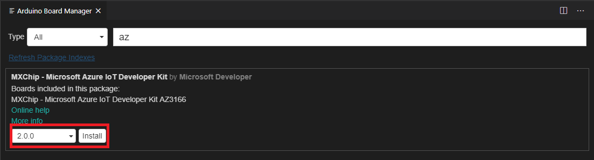
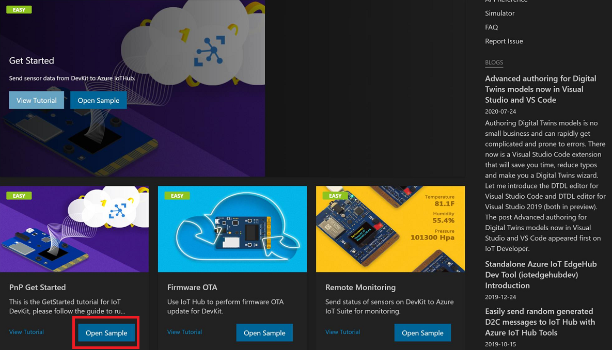
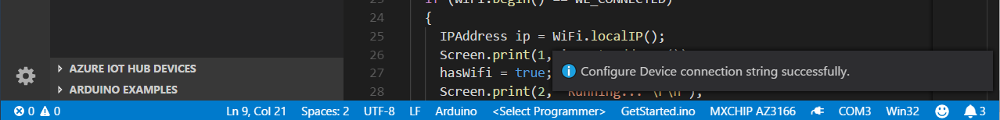
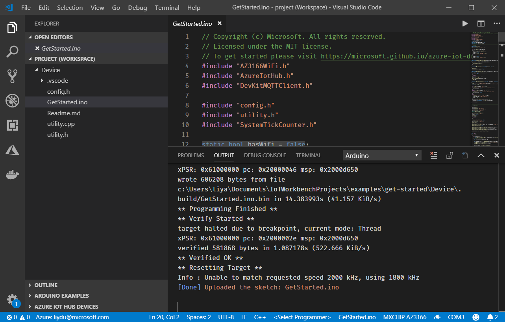
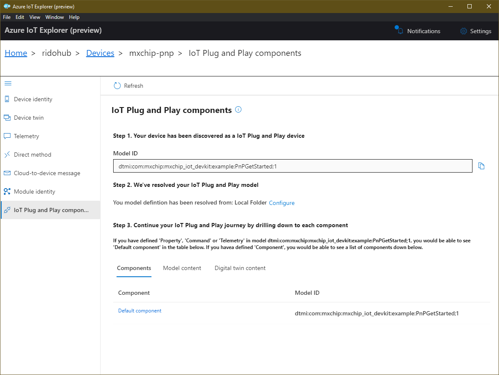
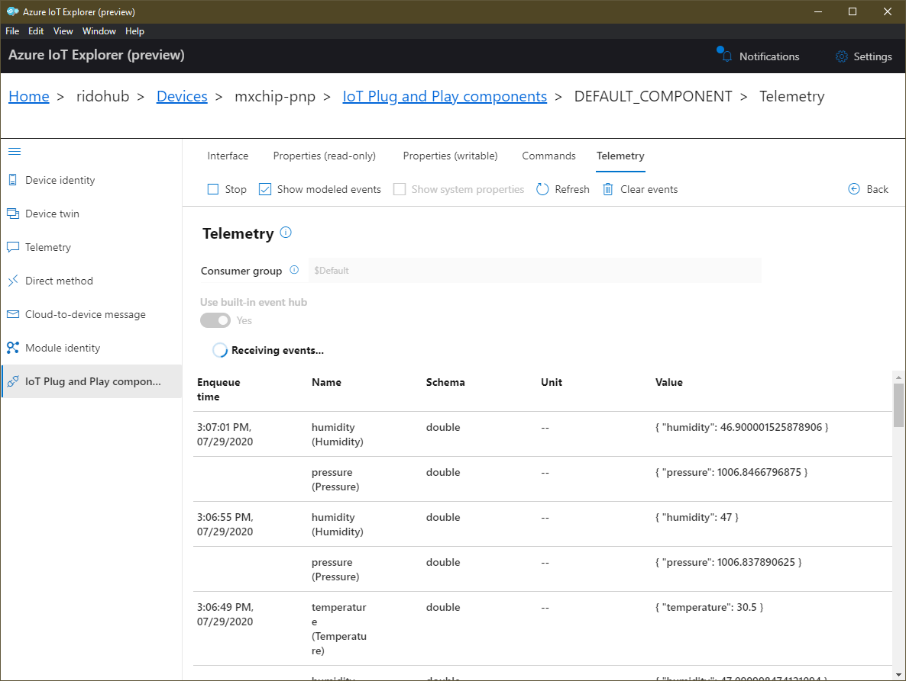
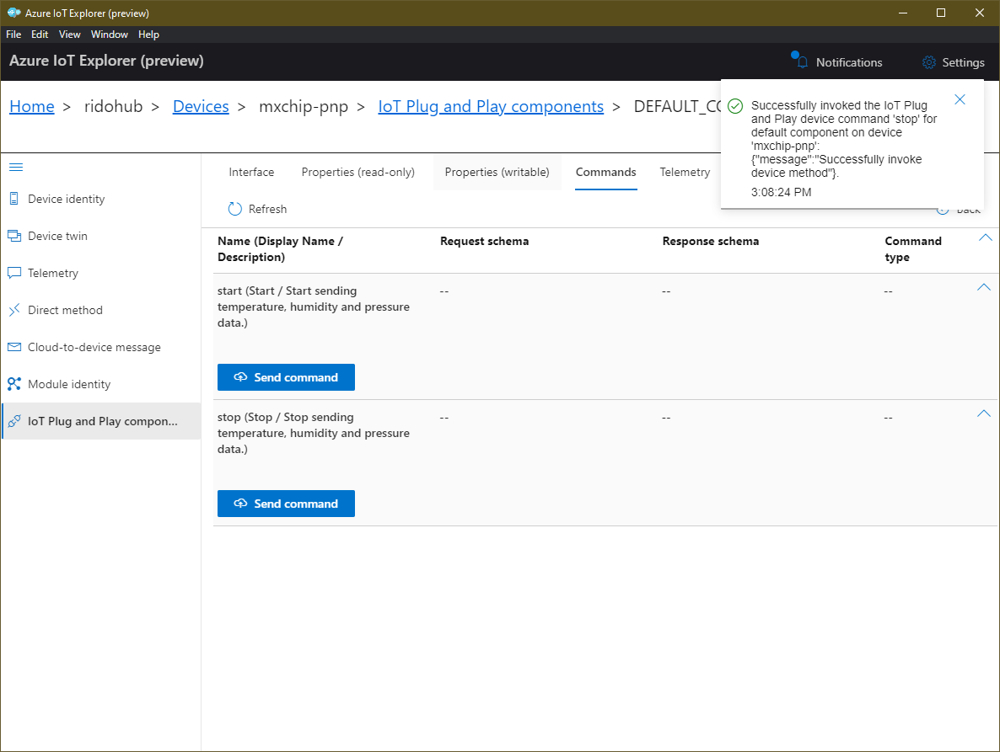

# Quickstart: Add IoT Plug and Play to your MXChip IoT DevKit

This quickstart shows you how to use to use IoT Plug and Play to easily interact with your MXChip device. To learn more about IoT Plug and Play see the [preview refresh annoucement blog post](https://aka.ms/iotblog/IoTPlugandPlay)

To get started connecting the [MXChip IoT DevKit](https://microsoft.github.io/azure-iot-developer-kit/) to Azure IoT Hub follow this other quickstart: 
[Connect IoT DevKit AZ3166 to Azure IoT Hub](/azure/iot-hub/iot-hub-arduino-iot-devkit-az3166-get-started).

## What you learn

* How to update the AZ3166 Azure IoT SDK to the latest version to use IoT Plug and play.
* How to use the DTDL VSCode extension to customize the model that describe the device implementation.
* How to use Azure IoT Explorer to view device telemetry, twin properties and invoking commands.

## What you need

* Azure IoT Explorer. A cross platform desktop application to interact with IoT Hub devices. [Get it now](https://docs.microsoft.com/azure/iot-pnp/howto-use-iot-explorer)
* A MXChip IoT DevKit board with a Micro-USB cable. [Get it now](https://aka.ms/iot-devkit-purchase).
* A computer running Windows 10, macOS 10.10+ or Ubuntu 18.04+.
* An active Azure subscription. If you do not have one, you can register via one of these methods:
  * [Activate a free 30-day trial Microsoft Azure account](https://azureinfo.microsoft.com/us-freetrial.html).
    * If you are an MSDN or Visual Studio subscriber. Claim your [Azure credit](https://azure.microsoft.com/pricing/member-offers/msdn-benefits-details/).
    * Finish the [Getting Started Guide](https://docs.microsoft.com/samples/azure-samples/mxchip-iot-devkit-get-started/sample/) to:
    * Prepare your hardware
    * Have your IoT DevKit connected to Wi-Fi.
    * Prepare the development environment. Please note that you should install the latest (2.0+) DevKit SDK with **Arduino: Board Manager**.



## Code, Build, Deploy, Run

You can get the sample code from this repository [Azure-Samples/mxchip-iot-devkit-pnp-get-started](https://github.com/Azure-Samples/mxchip-iot-devkit-pnp-get-started) or use the sample gallery:

### Open sample code from sample gallery

The IoT DevKit contains a rich gallery of samples that you can use to learn connect the DevKit to various Azure services.

1. Make sure your IoT DevKit is **not connected** to your computer. Start VS Code first, and then connect the DevKit to your computer.

2. Click `F1` to open the command palette, type and select **Azure IoT Device Workbench: Open Examples...**. Then select **IoT DevKit** as board.

3. In the IoT Workbench Examples page, find **PnP Get Started** and click **Open Sample**. Then selects the default path to download the sample code.

    

### Create the DTDL model

Every IoT Plug and Play device must be described by a [DTDL](https://aka.ms/dtdl) model, this sample starts reviewing the [PnPGetStarted.json](Device/PnPGetStarted.json) file that contains the interface used to describe this device. 

>[!Tip] There is a [DTDL extension for VSCode](https://marketplace.visualstudio.com/items?itemName=vsciot-vscode.vscode-dtdl) that includes intellisense and validation of DTDL interfaces.

Model Id: `dtmi:com:mxchip:mxchip_iot_devkit:example:PnPGetStarted;1`

|@type|Name|Schema|
|----|----|----|
|Telemetry|temperature|double|
|Telemetry|humidity|double|
|Telemetry|pressure|double|
|Property|sample|string|
|Command|start|void/void|
|Command|stop|void/void|

>Note: This model is using a single interface, for  information to create more complex models see how to use [Components](/azure/iot-pnp/concepts-components)

### Include the Model ID during the connection

The new AZ3166 Azure library includes support to include the `Model ID` during the connection, to do so the code to initialize the connection has been updated as:

```c
static const char model_id[] = "dtmi:com:mxchip:mxchip_iot_devkit:example:PnPGetStarted;1";

// in DevKitMQTTClient_Init()
if (modelId != NULL) {
    if (IoTHubClient_LL_SetOption(iotHubClientHandle, OPTION_MODEL_ID, modelId) != IOTHUB_CLIENT_OK)
    {
        LogError("Failed to set option \"model_id\"");
        return false;
    }
}
```

This is the only code change required to use IoT Plug and Play with this device.

### Configure the device

Use the IoT Workbench extension to compile the code, and flash the device with the new firmware as described in the previous Quickstart.

To configure your device connection string you must have provisioned your device before using your preferred option: Azure Portal, Azure IoT Explorer, CLI, VSCode IoTHub extension or any other tool compatible with IoT Hub REST APIs that can give you the  `DEVICE_CONNECTION_STRING`.

1. Once your device is connected and recognized by the VSCode IoT Workbench.
2. Click `F1` to open the command palette, type and select **Azure IoT Device Workbench: Configure Device Settings...**, then select **Config Device Connection String > Select IoT Hub Device Connection String**.

3. On DevKit, hold down **button A**, push and release the **reset** button, and then release **button A**. Your DevKit enters configuration mode and saves the connection string.

    

4. Click `F1` again, type and select **Azure IoT Device Workbench: Upload Device Code**. It starts compile and upload the code to DevKit.

    

The DevKit reboots and starts running the code.

> **[NOTE]
> If there is any errors or interruptions, you can always recover by running the command again.**

## Interact with the device using Azure IoT Explorer

Azure IoT explorer needs a local copy of the model file that matches the Model ID your device sends. The model file lets Azure IoT explorer display the telemetry, properties, and commands that your device implements.Configure a local folder from **Home->IoT Plug and Play Settings->Add Local Folder** where you stored the [PnPGetStarted.json](Device/PnPGetStarted.json). (already in the repo, close to the `.ino` file).

Once the device is successfully connected to IoT Hub, you should be able to see the Model ID in the IoT Plug and Play tab of IoT Explorer as shown in the screenshot below:



With the information available in the model, IoT Explorer can create a custom UI to interact with the device, below you can see how the telemetry is displayed and the UI to invoke the commands.





## Problems and feedback

If you encounter problems, you can check for a solution in the [IoT DevKit FAQ](https://microsoft.github.io/azure-iot-developer-kit/docs/faq/) or reach out to us from [Gitter](https://gitter.im/Microsoft/azure-iot-developer-kit). You can also give us feedback by leaving a comment on this page.

## Next steps

You have successfully connected an MXChip IoT DevKit to your IoT hub, and you have sent the captured sensor data to your IoT hub.

To continue to get started with Azure IoT Hub and to explore other IoT scenarios using IoT DevKit, see the following:

-[Translate voice message with Azure Cognitive Services](https://docs.microsoft.com/azure/iot-hub/iot-hub-arduino-iot-devkit-az3166-translator)
-[Retrieve a Twitter message with Azure Functions](https://docs.microsoft.com/azure/iot-hub/iot-hub-arduino-iot-devkit-az3166-retrieve-twitter-message)
-[Send messages to an MQTT server using Eclipse Paho APIs](https://docs.microsoft.com/azure/iot-hub/iot-hub-arduino-iot-devkit-az3166-mqtt-helloworld)
-[Monitor the magnetic sensor and send email notifications with Azure Functions](https://docs.microsoft.com/azure/iot-hub/iot-hub-arduino-iot-devkit-az3166-door-monitor)
