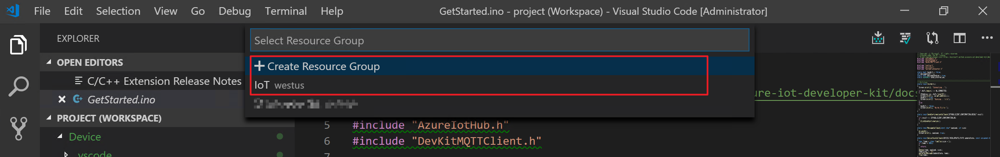

## GetStarted

You can use the [MXChip IoT DevKit](https://microsoft.github.io/azure-iot-developer-kit/) to develop and prototype Internet of Things (IoT) solutions that take advantage of Microsoft Azure services. It includes an Arduino-compatible board with rich peripherals and sensors, an open-source board package, and a rich [sample gallery](https://microsoft.github.io/azure-iot-developer-kit/docs/projects/).

## What you learn

* How to create an IoT hub and register a device for the MXChip IoT DevKit.
* How to connect the IoT DevKit to Wi-Fi and configure the IoT Hub connection string.
* How to send the DevKit sensor telemetry data to your IoT hub.
* How to prepare the development environment and develop application for the IoT DevKit.

Don't have a DevKit yet? Try the [DevKit simulator](https://azure-samples.github.io/iot-devkit-web-simulator/) or [purchase a DevKit](https://aka.ms/iot-devkit-purchase).

You can find the source code for all DevKit tutorials at the [IoTDevEnvExamples](https://github.com/IoTDevEnvExamples) repository.

## What you need

* A MXChip IoT DevKit board with a Micro-USB cable. [Get it now](https://aka.ms/iot-devkit-purchase).
* A computer running Windows 10, macOS 10.10+ or Ubuntu 18.04+.
* An active Azure subscription. If you do not have one, you can register via one of these methods:
    * [Activate a free 30-day trial Microsoft Azure account](https://azureinfo.microsoft.com/us-freetrial.html).
    * If you are an MSDN or Visual Studio subscriber. Claim your [Azure credit](https://azure.microsoft.com/pricing/member-offers/msdn-benefits-details/).
* Finish the [Getting Started Guide](https://docs.microsoft.com/en-us/samples/azure-samples/mxchip-iot-devkit-get-started/sample/) to:
    * Prepare your hardware 
    * Have your IoT DevKit connected to Wi-Fi.
    * Prepare the development environment. Please note that you should install the latest (2.0+) DevKit SDK with **Arduino: Board Manager**. 

## Build your PnP project

### Open sample code from sample gallery

The IoT DevKit contains a rich gallery of samples that you can use to learn connect the DevKit to various Azure services.

1. Make sure your IoT DevKit is **not connected** to your computer. Start VS Code first, and then connect the DevKit to your computer.

2. Click `F1` to open the command palette, type and select **Azure IoT Device Workbench: Open Examples...**. Then select **IoT DevKit** as board.

3. In the IoT Workbench Examples page, find **PnP Get Started** and click **Open Sample**. Then selects the default path to download the sample code.

    

### Provision Azure IoT Hub and device

Instead of provisioning Azure IoT Hub and device from the Azure portal, you can do it in the VS Code without leaving the development environment.

1. In the new opened project window, click `F1` to open the command palette, type and select **Azure IoT Device Workbench: Provision Azure Services...**. Follow the step by step guide to finish provisioning your Azure IoT Hub and creating the IoT Hub device.

    

    > **[NOTE]
    > If you have not signed in Azure. Follow the pop-up notification for signing in.**

2. Select the subscription you want to use.

    

3. Then select or create a new [resource group](https://docs.microsoft.com/azure/azure-resource-manager/resource-group-overview#terminology).

    

4. In the resource group you specified, follow the guide to select or create a new Azure IoT Hub.

    

    

    

5. In the output window, you will see the Azure IoT Hub provisioned.

    

6. Select or create a new device in Azure IoT Hub you provisioned.

    

    

7. Now you have Azure IoT Hub provisioned and device created in it. Also the device connection string will be saved in VS Code for configuring the IoT DevKit later.

    

### Configure and compile device code

1. In the bottom-right status bar, check the **MXCHIP AZ3166** is shown as selected board and serial port with **STMicroelectronics** is used.

    

2. Click `F1` to open the command palette, type and select **Azure IoT Device Workbench: Configure Device Settings...**, then select **Config Device Connection String > Select IoT Hub Device Connection String**.

3. On DevKit, hold down **button A**, push and release the **reset** button, and then release **button A**. Your DevKit enters configuration mode and saves the connection string.

    

4. Click `F1` again, type and select **Azure IoT Device Workbench: Upload Device Code**. It starts compile and upload the code to DevKit.

    

The DevKit reboots and starts running the code.

> **[NOTE]
> If there is any errors or interruptions, you can always recover by running the command again.**

## Test the project

You could view the telemetry sent to Auzre IoT Hub or received by Azure IoT Hub as **Test the project** section in 
[Azure MXChip IoT DevKit Get Started](https://docs.microsoft.com/en-us/samples/azure-samples/mxchip-iot-devkit-get-started/sample/). You could also use **Azure IoT explorer** with PnP device as the following guide. 

### View the telemetry received by Azure IoT Explorer

To interact with the sample device in the second part of this quickstart, you use the **Azure IoT explorer** tool. [Download and install the latest release of Azure IoT explorer](https://review.docs.microsoft.com/en-us/azure/iot-pnp/howto-use-iot-explorer) for your operating system.

Azure IoT explorer needs a local copy of the model file that matches the Model ID your device sends. The model file lets Azure IoT explorer display the telemetry, properties, and commands that your device implements. 

If you haven't already downloaded the sample model files:
1. Create a folder called *models* on your local machine.
2. Download [PnPGetStarted.json](Device/PnPGetStarted.json) and save the JSON file to the *models* folder.

Once the sample starts, you could use the Azure IoT explorer tool to verify it's working.
1. Open Azure IoT explorer.
2. On the **IoT hubs** page, if you haven't already added a connection to your IoT hub, select **+ Add connection**. Enter the connection string for the IoT hub you created previously and select **Save**.
3. On the **IoT Plug and Play Settings** page, select **+ Add > Local folder** and select the local *models* folder where you saved your model files.
4. On the **IoT hubs** page, click on the name of the hub you want to work with. You see a list of devices registered to the IoT hub.
5. Click on the **Device ID** of the device you created previously.
6. The menu on the left shows the different types of information available for the device.
7. Select IoT Plug and Play components to view the model information for your device.
8. You can view the different components of the device. The default component and any additional ones. Select a component to work with.
9. Select the **Telemetry** page and then select **Start** to view the telemetry data the device is sending for this component.
10. Select the **Properties (read-only)** page to view the read-only properties reported for this component.
11. Select the **Properties (writable)** page to view the writable properties you can update for this component. But we do not implement yje writeable Properties in this sample.
12. Select a property by it's **name**, enter a new value for it, and select **Update desired value**.
13. To see the new value show up select the **Refresh** button.
14. Select the **Commands** page to view all the commands for this component.
15. Select the command you want to test set the parameter if any. Select **Send** command to call the command on the device. You can see your device respond to the command in the command prompt window where the sample code is running.

## Review the code

This sample implements doesn't use IoT Plug and Play [components](https://review.docs.microsoft.com/en-us/azure/iot-pnp/concepts-components). You could also find more about [Digital Twin Definition Language](https://github.com/Azure/opendigitaltwins-dtdl).

## Problems and feedback

If you encounter problems, you can check for a solution in the [IoT DevKit FAQ](https://microsoft.github.io/azure-iot-developer-kit/docs/faq/) or reach out to us from [Gitter](https://gitter.im/Microsoft/azure-iot-developer-kit). You can also give us feedback by leaving a comment on this page.

## Next steps

You have successfully connected an MXChip IoT DevKit to your IoT hub, and you have sent the captured sensor data to your IoT hub.

To continue to get started with Azure IoT Hub and to explore other IoT scenarios using IoT DevKit, see the following:

- [Connect IoT DevKit to your Azure IoT Central application](https://docs.microsoft.com/en-us/azure/iot-central/howto-connect-devkit)
- [Connect IoT DevKit to Azure IoT Remote Monitoring solution accelerator](https://docs.microsoft.com/en-us/azure/iot-accelerators/iot-accelerators-arduino-iot-devkit-az3166-devkit-remote-monitoring-v2)
- [Translate voice message with Azure Cognitive Services](https://docs.microsoft.com/en-us/azure/iot-hub/iot-hub-arduino-iot-devkit-az3166-translator)
- [Retrieve a Twitter message with Azure Functions](https://docs.microsoft.com/en-us/azure/iot-hub/iot-hub-arduino-iot-devkit-az3166-retrieve-twitter-message)
- [Send messages to an MQTT server using Eclipse Paho APIs](https://docs.microsoft.com/en-us/azure/iot-hub/iot-hub-arduino-iot-devkit-az3166-mqtt-helloworld)
- [Monitor the magnetic sensor and send email notifications with Azure Functions](https://docs.microsoft.com/en-us/azure/iot-hub/iot-hub-arduino-iot-devkit-az3166-door-monitor)
